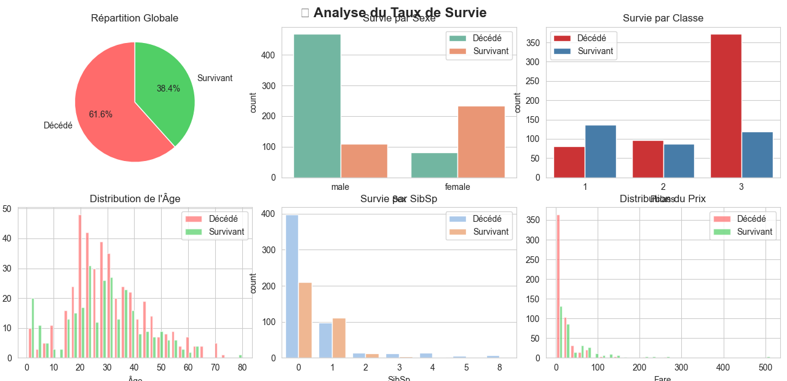
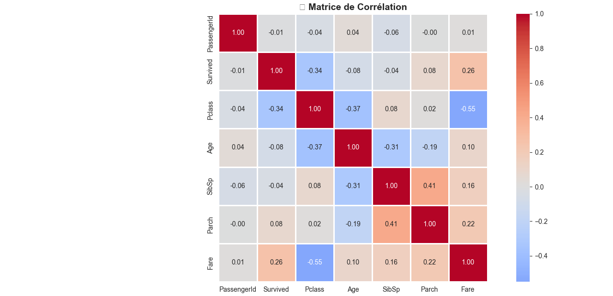
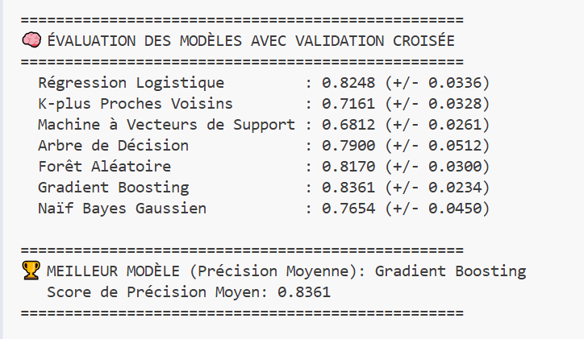

# 🚢 Projet Titanic : Prédiction de Survie

**Auteur :** Ettaoussi Soukaina

---

## 📋 Description du Projet

Ce projet vise à prédire la survie des passagers du Titanic en utilisant des techniques de Machine Learning. Il s'agit d'un projet classique de classification binaire basé sur le célèbre dataset Kaggle "Titanic - Machine Learning from Disaster".

L'objectif est d'analyser les caractéristiques des passagers (âge, sexe, classe, etc.) pour déterminer les facteurs qui ont influencé leur survie lors du naufrage du Titanic en 1912.

---

## 🎯 Objectifs

- Effectuer une **analyse exploratoire des données (EDA)** complète
- Créer de nouvelles **features** pertinentes (feature engineering)
- Gérer les **valeurs manquantes** de manière intelligente
- Évaluer plusieurs **modèles de classification**
- Sélectionner le **meilleur modèle** et générer des prédictions

---

## 📂 Structure du Projet

```
PROJET TITANIC/
│
├── data/                          # Données brutes
│   ├── train.csv                  # Jeu d'entraînement
│   ├── test.csv                   # Jeu de test
│   └── gender_submission.csv      # Exemple de soumission
│
├── processed_data/                # Données prétraitées
│   ├── X_train_processed.csv      # Features d'entraînement
│   ├── y_train_processed.csv      # Cible d'entraînement
│   └── X_test_processed.csv       # Features de test
│
├── Screenshots/                   # Captures d'écran des résultats
│   ├── titanic_preprocessing.png
│   ├── evaluate_models_by_cross_validation.png
│   ├── train_final_and_prediction.png
│   ├── MatrixCorrelation.png
│   └── visualisation.png
│
├── 01_eda_preprocessing.py        # Script de prétraitement
├── 02_modeling.py                 # Script de modélisation
├── submission_titanic.csv         # Fichier de soumission Kaggle
└── Readme.md                      # Documentation du projet
```

---

## 🔧 Technologies Utilisées

### Langages et Bibliothèques
- **Python 3.x**
- **pandas** : Manipulation des données
- **numpy** : Calculs numériques
- **matplotlib & seaborn** : Visualisations
- **scikit-learn** : Modèles de Machine Learning

### Modèles Évalués
- Régression Logistique
- K-plus Proches Voisins (KNN)
- Machine à Vecteurs de Support (SVM)
- Arbre de Décision
- Forêt Aléatoire (Random Forest)
- **Gradient Boosting** ⭐ (Meilleur modèle)
- Naïf Bayes Gaussien

---

## 📊 Pipeline de Preprocessing


### 1. **Analyse Exploratoire (EDA)**
- Statistiques descriptives
- Analyse des valeurs manquantes
- Visualisation des distributions
- Matrice de corrélation

#### Visualisations de Survie


#### Matrice de Corrélation


### 2. **Feature Engineering**
Création de nouvelles features :
- **Title** : Extraction du titre depuis le nom (Mr, Mrs, Miss, Master, Rare)
- **FamilySize** : Taille de la famille (SibSp + Parch + 1)
- **IsAlone** : Indicateur de passager seul
- **AgeGroup** : Catégories d'âge (Enfant, Adolescent, Adulte, Senior, Âgé)
- **FareGroup** : Catégories de prix (Bas, Moyen, Élevé, Très élevé)
- **Deck** : Pont du bateau (première lettre de Cabin)

### 3. **Gestion des Valeurs Manquantes**
- **Age** : Imputation par la médiane selon le titre et la classe
- **Embarked** : Imputation par le mode
- **Fare** : Imputation par la médiane
- **Cabin** : Création d'une catégorie "Unknown"

### 4. **Encodage**
- **Label Encoding** pour la variable binaire (Sex)
- **One-Hot Encoding** pour les variables catégorielles (Embarked, Title, Deck, AgeGroup, FareGroup)

---

## 🧠 Résultats des Modèles

### Scores de Validation Croisée (10-Fold)



| Modèle                           | Précision Moyenne | Écart-type |
|----------------------------------|-------------------|------------|
| Régression Logistique            | 0.8248            | ±0.0336    |
| K-plus Proches Voisins           | 0.7161            | ±0.0328    |
| Machine à Vecteurs de Support    | 0.6812            | ±0.0261    |
| Arbre de Décision                | 0.7900            | ±0.0512    |
| Forêt Aléatoire                  | 0.8170            | ±0.0300    |
| **Gradient Boosting** 🏆         | **0.8361**        | **±0.0234** |
| Naïf Bayes Gaussien              | 0.7654            | ±0.0450    |

### 🏆 Meilleur Modèle
**Gradient Boosting Classifier** avec une précision moyenne de **83.61%**

### Entraînement Final et Prédictions


---

## 🚀 Utilisation

### Installation des dépendances
```bash
pip install pandas numpy matplotlib seaborn scikit-learn
```

### Exécution du projet

#### Étape 1 : Preprocessing
```bash
python 01_eda_preprocessing.py
```
Ce script génère :
- Les fichiers CSV prétraités dans `processed_data/`
- Des visualisations pour l'EDA

#### Étape 2 : Modélisation
```bash
python 02_modeling.py
```
Ce script :
- Évalue tous les modèles avec validation croisée
- Entraîne le meilleur modèle
- Génère le fichier de soumission `submission_titanic.csv`

---

## 📈 Insights Clés

### Facteurs de Survie Identifiés
1. **Sexe** : Les femmes avaient un taux de survie beaucoup plus élevé
2. **Classe** : Les passagers de 1ère classe avaient plus de chances de survie
3. **Âge** : Les enfants avaient un taux de survie supérieur
4. **Taille de la famille** : Les petites familles (2-4 personnes) s'en sortaient mieux
5. **Prix du billet** : Corrélation positive avec la survie

### Corrélations Principales
- **Sex** et **Survived** : Forte corrélation négative (encodée : 0=female, 1=male)
- **Pclass** et **Survived** : Corrélation négative (classe inférieure = moins de survie)
- **Fare** et **Survived** : Corrélation positive

---

## 📝 Conclusions

Ce projet démontre l'importance d'un preprocessing rigoureux et d'un feature engineering créatif. Le modèle **Gradient Boosting** s'est révélé le plus performant avec une précision de **83.61%**, surpassant les modèles plus simples comme la régression logistique.

Les résultats confirment les facteurs socio-économiques et démographiques qui ont influencé la survie lors de la tragédie du Titanic : la règle "les femmes et les enfants d'abord" était clairement appliquée, et la classe sociale jouait un rôle déterminant.

---

## 📧 Contact

**Ettaoussi Soukaina**

Pour toute question ou suggestion concernant ce projet, n'hésitez pas à me contacter.

---

## 📜 Licence

Ce projet est réalisé dans un cadre éducatif et utilise le dataset public Kaggle Titanic.

---

*Projet réalisé avec passion pour l'apprentissage automatique et l'analyse de données* 🚢💙